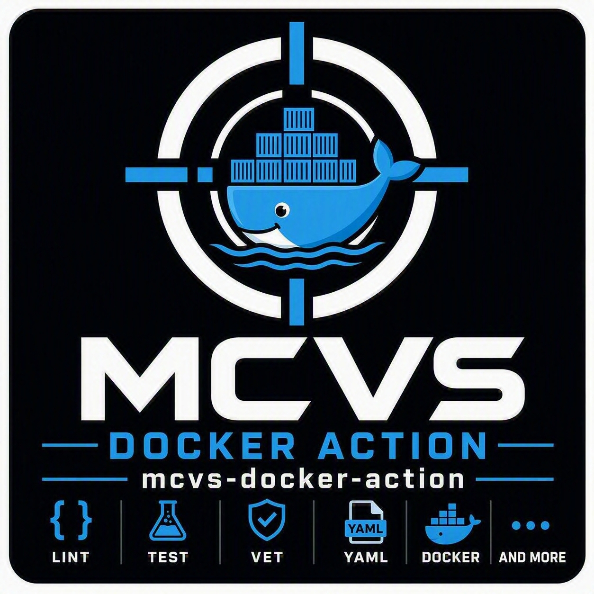

# MCVS Docker Action

[](https://github.com/schubergphilis/mcvs-docker-action/releases)
[](LICENSE)

</a>

Mission Critical Vulnerability Scanner (MCVS) Docker Action is a comprehensive GitHub Action that provides a complete Docker image security and quality validation pipeline. This action combines multiple industry-standard tools to ensure your Docker images meet security and quality standards before deployment.

## Features

This action provides a complete CI/CD pipeline for Docker images with the following capabilities:

- **Dockerfile Linting**: Static analysis using [hadolint](https://github.com/hadolint/hadolint) to enforce best practices
- **Automated Tagging**: Smart image tagging based on Git context (branches, tags, commits)
- **Multi-Architecture Builds**: `linux/amd64` and `linux/arm64` images are built with [Buildx](https://docs.docker.com/build/) and published as a single manifest list
- **Image Building**: Efficient Docker image building with support for build arguments
- **Image Linting**: CIS Docker benchmark compliance checking using [Dockle](https://github.com/goodwithtech/dockle)
- **Efficiency Analysis**: Layer-by-layer waste detection using [Dive](https://github.com/wagoodman/dive)
- **Multi-Scanner Security**: Triple-layer security scanning with:
  - **Grype**: Scans both source code and built images for vulnerabilities
- **Automated Registry Push**: Conditional push to GitHub Container Registry or Docker Hub on tagged releases

## Quick Start

Create a `.github/workflows/docker.yml` file in your repository:

```yaml
---
name: Docker
on:
  push:
    branches: [main]
    tags: ["v*"]
  pull_request:
    branches: [main]

permissions:
  contents: read
  packages: write

jobs:
  build:
    runs-on: ubuntu-24.04
    steps:
      - uses: actions/checkout@v4
      - uses: schubergphilis/mcvs-docker-action@v0.1.0
        with:
          token: ${{ secrets.GITHUB_TOKEN }}
```

## Usage Examples

### Basic Usage

For a simple single Dockerfile project:

```yaml
- uses: schubergphilis/mcvs-docker-action@v0.1.0
  with:
    token: ${{ secrets.GITHUB_TOKEN }}
```

### Custom Build Arguments

Pass build arguments to your Docker build:

```yaml
- uses: schubergphilis/mcvs-docker-action@v0.1.0
  with:
    build-args: my-application
    token: ${{ secrets.GITHUB_TOKEN }}
```

For multiple build arguments, use multiline format:

```yaml
- uses: schubergphilis/mcvs-docker-action@v0.1.0
  with:
    build-args: |
      APPLICATION=my-app
      VERSION=${{ github.ref_name }}
      BUILD_DATE=${{ github.event.head_commit.timestamp }}
    token: ${{ secrets.GITHUB_TOKEN }}
```

### Matrix Builds

Build multiple images from the same repository:

```yaml
jobs:
  build:
    strategy:
      matrix:
        config:
          - name: main-app
            build-args: main-application
            context: ./app
            suffix: ""
          - name: cli-tool
            build-args: cli-application
            context: ./cli
            suffix: /cli
    runs-on: ubuntu-24.04
    steps:
      - uses: actions/checkout@v4
      - uses: schubergphilis/mcvs-docker-action@v0.1.0
        with:
          build-args: ${{ matrix.config.build-args }}
          context: ${{ matrix.config.context }}
          images: ghcr.io/${{ github.repository }}${{ matrix.config.suffix }}
          token: ${{ secrets.GITHUB_TOKEN }}
```

### Multi-Architecture Builds

By default the action builds and pushes both `linux/amd64` and `linux/arm64`.
No configuration is required:

```yaml
- uses: schubergphilis/mcvs-docker-action@v0.1.0
  with:
    token: ${{ secrets.GITHUB_TOKEN }}
```

The `linux/arm64` image is built through QEMU emulation, which makes tagged
releases slower. To build a single architecture instead:

```yaml
- uses: schubergphilis/mcvs-docker-action@v0.1.0
  with:
    platforms: linux/amd64
    token: ${{ secrets.GITHUB_TOKEN }}
```

Only one image can be loaded into the local Docker image store, so Dockle, Dive
and Grype scan a single platform per job: `linux/amd64` when it is in the list,
otherwise the first entry. A warning is emitted for every platform that is built
but not scanned. To scan every architecture, give each one its own job as
described below.

Additional platforms, e.g. `linux/arm/v7`, can be added to the list and are
built and pushed like any other.

Do not hardcode a platform in the Dockerfile, e.g. `FROM --platform=linux/amd64
alpine`, as hadolint rejects that with
[DL3029](https://github.com/hadolint/hadolint/wiki/DL3029). The action passes
`--platform` to Buildx, which provides `BUILDPLATFORM`, `TARGETPLATFORM`,
`TARGETOS` and `TARGETARCH` to the build.

#### Scanning Every Architecture

Only one image can be loaded into the local Docker image store, so a job scans a
single platform. To scan every architecture, run the action in a matrix with one
platform per job, which GitHub executes in parallel:

```yaml
jobs:
  scan:
    strategy:
      matrix:
        platform:
          - linux/amd64
          - linux/arm64
    runs-on: ${{ matrix.platform == 'linux/arm64' && 'ubuntu-24.04-arm' || 'ubuntu-24.04' }}
    permissions:
      contents: read
    steps:
      - uses: actions/checkout@v4
      - uses: schubergphilis/mcvs-docker-action@v0.1.0
        with:
          platforms: ${{ matrix.platform }}
          push-to-container-registry: ""
```

Each job runs the complete pipeline for its own platform, i.e. hadolint, the
build, Dockle, Dive and Grype. Picking a runner that matches the architecture
also avoids QEMU emulation entirely.

Note that:

- This matrix does not push. `push-to-container-registry: ""` disables it,
  because jobs that each push the same tag would overwrite one another instead of
  producing a manifest list. Keep the ordinary single job shown above for the
  release, which builds every platform and pushes one manifest list.
- This is optional. The single job example above keeps working unchanged and
  needs no matrix.

### Custom Dockerfile Location

If your Dockerfile is not in the repository root:

```yaml
- uses: schubergphilis/mcvs-docker-action@v0.1.0
  with:
    context: ./docker/production
    token: ${{ secrets.GITHUB_TOKEN }}
```

### Handling Dockle False Positives

When Dockle incorrectly flags specific package versions as secrets:

```yaml
- uses: schubergphilis/mcvs-docker-action@v0.1.0
  with:
    dockle-accept-key: libcrypto3,libssl3
    token: ${{ secrets.GITHUB_TOKEN }}
```

### Push to Docker Hub

Push images to Docker Hub instead of GHCR:

```yaml
- uses: schubergphilis/mcvs-docker-action@v0.1.0
  with:
    images: my-org/my-app
    push-to-container-registry: dockerhub
    dockerhub-username: ${{ secrets.DOCKERHUB_USERNAME }}
    dockerhub-token: ${{ secrets.DOCKERHUB_TOKEN }}
    token: ${{ secrets.GITHUB_TOKEN }}
```

### Disable Registry Push

Build and scan without pushing to any registry:

```yaml
- uses: schubergphilis/mcvs-docker-action@v0.1.0
  with:
    push-to-container-registry: ""
    token: ${{ secrets.GITHUB_TOKEN }}
```

## Input Parameters

| Parameter                    | Required | Default                            | Description                                                                                                                                                                                     |
| ---------------------------- | -------- | ---------------------------------- | ----------------------------------------------------------------------------------------------------------------------------------------------------------------------------------------------- |
| `token`                      | No       | -                                  | GitHub token for pushing images to GHCR. Use `${{ secrets.GITHUB_TOKEN }}`                                                                                                                      |
| `build-args`                 | No       | -                                  | Docker build arguments. Single-line values are formatted as `APPLICATION=value`. Multiline values are passed as-is                                                                              |
| `context`                    | No       | `.`                                | Directory containing the Dockerfile and build context                                                                                                                                           |
| `images`                     | No       | `ghcr.io/${{ github.repository }}` | Image name(s) for tagging. Override when using Docker Hub (e.g., `my-org/my-app`)                                                                                                               |
| `platforms`                  | No       | `linux/amd64,linux/arm64`          | Comma separated list of target platforms to build for. Set to `linux/amd64` for single architecture builds. One platform is scanned per job                                                     |
| `push-to-container-registry` | No       | `ghcr`                             | Registry to push to. Values: `ghcr`, `dockerhub`, or `""` to disable pushing                                                                                                                    |
| `dockerhub-username`         | No       | -                                  | Docker Hub username. Required when `push-to-container-registry` is `dockerhub`                                                                                                                  |
| `dockerhub-token`            | No       | -                                  | Docker Hub access token. Required when `push-to-container-registry` is `dockerhub`                                                                                                              |
| `dockle-accept-key`          | No       | -                                  | Comma-separated list of package names to exclude from Dockle secret detection. Use for known false positives (see [goodwithtech/dockle#250](https://github.com/goodwithtech/dockle/issues/250)) |
| `grype-version`              | No       | latest                             | Specific version of Grype to use for vulnerability scanning                                                                                                                                     |

## Security Scanning

This action employs a defense-in-depth approach with multiple security scanners:

### Grype Scanning

- **Code Scan**: Scans source code in the build context for vulnerabilities
  - Severity cutoff: HIGH
  - Reports unfixed vulnerabilities
- **Image Scan**: Scans the built Docker image for vulnerabilities
  - Severity cutoff: HIGH
  - Reports unfixed vulnerabilities
  - Runs once per job, against the scanned platform

### Dive Efficiency Analysis

- Analyzes image layers for wasted space
- Runs in CI mode (`--ci`) and reads thresholds from a `.dive-ci` file in your
  repository root when present
- Example `.dive-ci` configuration:

```yaml
rules:
  lowestEfficiency: 0.95
  highestWastedBytes: 20MB
  highestUserWastedPercent: 0.20
```

See the [Dive CI documentation](https://github.com/wagoodman/dive#ci-integration)
for all available options.

### Dockle Linting

- Validates CIS Docker benchmarks
- Permanently ignores:
  - `CIS-DI-0005`: Content trust (not achievable on public runners)
  - `CIS-DI-0006`: HEALTHCHECK (left to consumer discretion)

## Image Push Behavior

Images are automatically pushed to the configured container registry **only when all conditions are met**:

1. The workflow is triggered by a `push` event (not pull requests)
2. The push is to a Git tag (matches `refs/tags/*`)
3. The `push-to-container-registry` input is set to `ghcr` or `dockerhub`

| Registry   | `push-to-container-registry` | `images` override needed?   | Credentials                              |
| ---------- | ---------------------------- | --------------------------- | ---------------------------------------- |
| GHCR       | `ghcr` (default)             | No                          | `token` (GITHUB_TOKEN)                   |
| Docker Hub | `dockerhub`                  | Yes (e.g., `my-org/my-app`) | `dockerhub-username` + `dockerhub-token` |
| None       | `""`                         | -                           | -                                        |

This ensures images are only published for tagged releases, keeping your registry clean and organized.

A manifest list covering every platform in the `platforms` input is pushed, so consumers automatically pull the image that matches their architecture.

## Required Permissions

Your workflow needs these permissions to function correctly:

```yaml
permissions:
  contents: read # Required to checkout code
  packages: write # Required to push images to GHCR
```

## Troubleshooting

### Dockle Reports False Positives for Package Versions

**Problem**: Dockle incorrectly identifies package names containing version numbers as leaked secrets.

**Solution**: Use the `dockle-accept-key` input to exclude specific packages:

```yaml
dockle-accept-key: libcrypto3,libssl3,python3.11
```

See [goodwithtech/dockle#250](https://github.com/goodwithtech/dockle/issues/250) for more details.

### Image Not Pushed to Registry

**Problem**: The image builds successfully but doesn't appear in the registry.

**Possible causes**:

1. Not using a tag: Push only occurs on tag events (e.g., `v1.0.0`)
2. Missing permissions: Ensure `packages: write` permission is set (GHCR)
3. Push disabled: Check if `push-to-container-registry` is set to `""`
4. Wrong registry: Ensure `push-to-container-registry` matches your intended registry (`ghcr` or `dockerhub`)
5. Docker Hub credentials: When using `dockerhub`, ensure both `dockerhub-username` and `dockerhub-token` are provided
6. Image name mismatch: When using Docker Hub, override `images` to match your Docker Hub repository (e.g., `my-org/my-app`)

### hadolint DL3029: Do Not Use --platform Flag with FROM

**Problem**: hadolint fails with [DL3029](https://github.com/hadolint/hadolint/wiki/DL3029) because a `FROM` instruction hardcodes a platform, e.g. `FROM --platform=linux/amd64 alpine`.

**Solution**: Do not hardcode the platform. The action passes the target platforms to Buildx, which sets `BUILDPLATFORM`, `TARGETPLATFORM`, `TARGETOS` and `TARGETARCH` for you. Only these variables are accepted by DL3029:

```dockerfile
FROM --platform=$BUILDPLATFORM golang:1.24 AS build
ARG TARGETOS TARGETARCH
RUN GOOS=$TARGETOS GOARCH=$TARGETARCH go build -o /app .
```

### Build Arguments Not Working

**Problem**: Build arguments are not being passed correctly to Docker build.

**Solution**: For single values, use plain text (automatically formatted as `APPLICATION=value`):

```yaml
build-args: my-app
```

For multiple arguments, use multiline format:

```yaml
build-args: |
  ARG1=value1
  ARG2=value2
```

## Contributing

Contributions are welcome. Please open an issue or pull request for bugs, features, or improvements.

## License

See [LICENSE](LICENSE) file for details.
